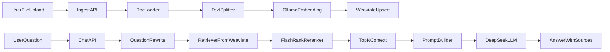

# FastAPI RAG 实施方案（从 0 到可用 MVP，含 Rewrite + Rerank）

## 1. 目标与范围

- 技术栈：FastAPI、LangChain、Weaviate、DeepSeek API、Ollama(`nomic-embed-text-v2-moe:latest`)、FlashRank。
- 首版能力：
  - 本地文件上传导入（PDF/Markdown/TXT）
  - 文档切分 + 向量化 + 写入 Weaviate
  - 基于 RAG 的对话问答 API（支持 Question Rewrite + FlashRank 重排）
  - 简易调试页面（可上传、可提问、可查看返回来源片段）
- 非目标（MVP 暂不做）：多租户、复杂权限、生产级监控告警。

## 2. 建议目录结构

- 项目根配置：[`pyproject.toml`](pyproject.toml)、[`.env.example`](.env.example)、[`README.md`](README.md)
- 应用入口：[`app/main.py`](app/main.py)
- 配置管理：[`app/core/config.py`](app/core/config.py)
- 数据模型：[`app/schemas/chat.py`](app/schemas/chat.py)、[`app/schemas/ingest.py`](app/schemas/ingest.py)
- 路由层：[`app/api/routes/chat.py`](app/api/routes/chat.py)、[`app/api/routes/ingest.py`](app/api/routes/ingest.py)、[`app/api/routes/health.py`](app/api/routes/health.py)
- RAG 核心：[`app/services/rag/pipeline.py`](app/services/rag/pipeline.py)、[`app/services/rag/retriever.py`](app/services/rag/retriever.py)、[`app/services/rag/chains.py`](app/services/rag/chains.py)、[`app/services/rag/rewrite.py`](app/services/rag/rewrite.py)、[`app/services/rag/reranker.py`](app/services/rag/reranker.py)
- 文档处理：[`app/services/ingest/loaders.py`](app/services/ingest/loaders.py)、[`app/services/ingest/splitter.py`](app/services/ingest/splitter.py)、[`app/services/ingest/sanitizer.py`](app/services/ingest/sanitizer.py)
- 向量库封装：[`app/integrations/weaviate_client.py`](app/integrations/weaviate_client.py)
- 模型封装：[`app/integrations/deepseek_llm.py`](app/integrations/deepseek_llm.py)、[`app/integrations/ollama_embeddings.py`](app/integrations/ollama_embeddings.py)
- 调试页面：[`app/web/index.html`](app/web/index.html)、[`app/web/app.js`](app/web/app.js)
- 测试：[`tests/test_chat_api.py`](tests/test_chat_api.py)、[`tests/test_ingest_api.py`](tests/test_ingest_api.py)、[`tests/test_rag_pipeline.py`](tests/test_rag_pipeline.py)

## 3. 端到端数据流

## 4. 分阶段实施

### Phase A：工程骨架与配置

- 初始化 Python 项目与依赖管理（FastAPI、LangChain、Weaviate SDK、Ollama/HTTP、FlashRank、测试工具）。
- 建立配置体系（`.env` + `pydantic-settings`），统一管理 API Key、Weaviate URL、Ollama Base URL、模型名、默认 chunk 参数、rewrite/rerank 参数。
- 提供健康检查与启动脚本，确保本地一键跑通。

### Phase B：知识入库链路（Ingest）

- 实现文件上传接口（支持 PDF/MD/TXT），带文件类型校验与大小限制。
- 实现多格式 Loader + 文本清洗 + chunk 切分（可配置 chunk_size/chunk_overlap）。
- 封装 Ollama Embedding 调用并批量写入 Weaviate（含 metadata：文件名、段落序号、时间戳）。
- 增加幂等策略（同文件哈希重复上传可跳过/覆盖）。

### Phase C：RAG 问答链路（Chat）

- 实现 Question Rewrite（将原问题改写为更适合检索的查询；可选利用最近对话上下文）。
- 构建 Retriever（Top-K 粗召回 + 可选相似度阈值）。
- 集成 FlashRank 对粗召回结果重排，输出 Top-N 高相关片段进入生成阶段。
- 构建 Prompt 模板（系统指令 + 重排后上下文 + 用户问题），接 DeepSeek Chat API。
- 返回结构化响应：答案、引用片段、来源文件，并可返回 `rewritten_query` 便于调试。
- 增加基本错误处理与超时重试（网络/空检索/API异常）。

### Phase D：简易调试页面

- 提供静态页面：上传文档、发起提问、展示答案与引用。
- 对接后端接口，支持快速联调与演示。

### Phase E：质量与交付

- 单元测试与 API 测试：覆盖 ingest/chat 的主流程与关键异常分支（含 rewrite/rerank）。
- 日志与可观测性基础：请求 ID、关键耗时（embedding/retrieval/rerank/llm）。
- 完善 README：环境准备、启动步骤、curl 示例、常见问题。

## 5. 接口草案（MVP）

- `POST /api/ingest/files`：上传并入库，返回文档 ID 与切片统计。
- `POST /api/chat`：输入问题（可选会话 ID、`enable_rewrite`、`enable_rerank`），返回答案 + sources + rewritten_query（可选）。
- `GET /api/health`：服务健康检查。
- `GET /`：调试页面入口。

## 6. 验收标准

- 可成功上传 PDF/MD/TXT 并写入 Weaviate。
- 问答接口支持 Question Rewrite 和 FlashRank 重排，并可在响应中体现改写问题（调试模式）。
- 问答接口能基于重排后的知识片段返回答案，且包含可追溯来源片段。
- 在无检索结果时可返回明确提示，不出现 500 崩溃。
- README 按步骤可在新环境完成部署并跑通示例。

## 7. 风险与预案

- Ollama embedding 吞吐较低：采用批处理与并发上限控制。
- 文档切分质量影响召回：预留可配置参数并提供默认推荐值。
- Rewrite 可能引入语义偏移：保留原问题并支持开关，便于回退与对比。
- FlashRank 模型性能与速度需权衡：默认轻量模型，预留可配置项。
- DeepSeek API 波动：统一超时、重试和降级错误信息。
