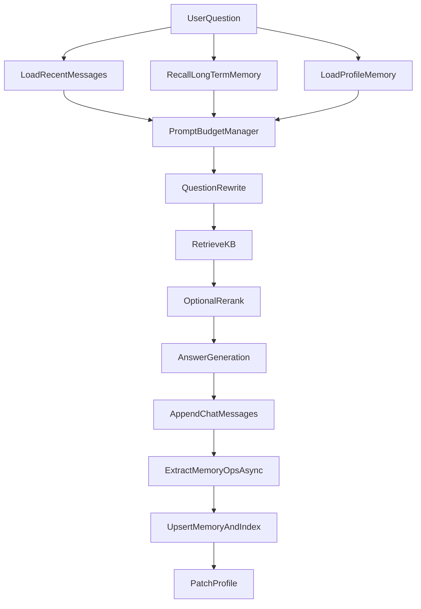

# RAG 多轮会话长短期记忆方案（可落地版）

本文档用于解决当前多轮会话中“完整历史直接入模导致上下文超限”的问题，并在现有项目结构上提供最小侵入式改造方案。

## 1. 背景与目标

当前实现会将最近多轮对话直接拼接到 Rewrite 与 Answer prompt 中。随着会话变长，存在以下问题：

- 上下文 token 持续增长，最终超过 LLM 上限；
- 历史中噪声信息变多，影响检索与生成质量；
- 有价值的长期信息（偏好、约束、已决策事项）无法稳定复用。

目标：

- 保留多轮连续性，同时控制上下文长度；
- 将“可复用历史”沉淀为长期记忆并可语义召回；
- 通过 feature flag 平滑接入，不破坏现有 RAG 主流程。

## 2. 总体架构（三层记忆）

### 2.1 记忆分层

- 短期记忆（Working Memory）
  - 存储最近 K 轮原始消息（Mongo）
  - 用于维持当前对话局部连贯性
- 长期记忆（Long-term Memory）
  - 从对话中提炼 memory item（事实/偏好/约束/决议）
  - 向量化后存入记忆索引（Weaviate）并保留主记录（Mongo）
- 用户画像（Profile Memory）
  - 结构化稳定偏好与固定约束（JSON）
  - token 成本低，优先入模

### 2.2 执行流



## 3. memory item 设计

### 3.1 类型定义

- `fact`：稳定事实（项目信息、用户背景、已确认事实）
- `preference`：偏好（语言、风格、粒度）
- `constraint`：硬约束（禁止行为、必须遵守的规则）
- `decision`：已确定决策（技术选型、流程结论）

### 3.2 数据结构（建议）

```json
{
  "memory_id": "uuid",
  "session_id": "string",
  "user_id": "string|null",
  "scope": "session|user",
  "type": "fact|preference|constraint|decision",
  "content": "用户要求所有回复使用中文简体",
  "summary": "回复语言约束",
  "confidence": 0.95,
  "salience": 0.9,
  "is_active": true,
  "source_message_ids": ["..."],
  "created_at": "ISO8601",
  "updated_at": "ISO8601",
  "last_accessed_at": "ISO8601|null",
  "expires_at": "ISO8601|null"
}
```

## 4. 写路径：从对话提炼长期记忆

### 4.1 触发时机

在 `ChatRagService.chat()` 末尾（写入聊天消息后）异步触发，不阻塞主响应。

### 4.2 输入与输出

- 输入：
  - 当前轮 `user_question`
  - 当前轮 `assistant_answer`
  - 最近 1~2 轮对话（用于上下文判断）
- 输出：
  - `MemoryOp[]`，操作类型为 `add/update/delete/ignore`

示例：

```json
{
  "ops": [
    {
      "op": "add",
      "type": "constraint",
      "scope": "session",
      "content": "回答统一使用中文简体",
      "confidence": 0.93,
      "salience": 0.89
    }
  ]
}
```

### 4.3 抽取准则（避免噪声）

- 仅提炼“未来可复用信息”；
- 忽略一次性闲聊、重复表达、无约束价值内容；
- 对冲突信息触发 `update` 或 `delete`，而不是盲目新增。

### 4.4 去重与冲突处理

- 语义去重：新 memory 与已有 memory 计算向量相似度，超过阈值视为同类；
- 冲突合并：同类型冲突按下式保留主版本：
  - `priority = recency * confidence * salience`
- 历史版本保留但置 `is_active=false` 以支持审计。

## 5. 读路径：语义召回长期记忆入模

### 5.1 召回步骤

1. 对当前 query（或 rewritten_query）生成 embedding；
2. 在记忆向量索引检索 `top_k`；
3. 按 `is_active`、过期状态、最小相似度阈值过滤；
4. 综合排序后截断少量条目入模（如 3~6 条）。

### 5.2 打分策略（建议）

- `final_score = sim_score * type_weight * time_decay * confidence`

建议权重：

- `constraint`: 1.3
- `preference`: 1.15
- `decision`: 1.05
- `fact`: 1.0

### 5.3 Prompt 注入优先级

推荐按优先级注入，保证上下文预算可控：

1. 用户画像（稳定约束/偏好）
2. 长期记忆召回结果（高分少量）
3. 短期最近轮次（预算不足时裁剪）

## 6. 存储方案

### 6.1 Mongo（主存）

新增集合：

- `chat_memories`：memory item 主记录
- `chat_profiles`：用户画像 JSON

### 6.2 Weaviate（索引）

新增 collection（建议名 `ConversationMemory`）：

- 主字段：`content`（文本）
- 元数据：`memory_id`, `session_id`, `user_id`, `scope`, `type`, `confidence`, `salience`, `is_active`, `created_at`, `expires_at`
- 向量：`content_embedding`

## 7. 与现有代码的改造点

### 7.1 配置层

文件：`app/core/config.py`

新增建议配置：

- `MEMORY_ENABLE=true`
- `MEMORY_WRITE_ASYNC=true`
- `MEMORY_LONG_TOP_K=6`
- `MEMORY_MIN_SCORE=0.45`
- `MEMORY_SHORT_MAX_TOKENS=1200`
- `MEMORY_PROFILE_ENABLE=true`

### 7.2 服务层

目录：`app/services/rag/`

新增文件建议：

- `memory_store.py`：Mongo + Weaviate 读写封装
- `memory_extractor.py`：LLM 抽取 MemoryOp
- `memory_recall.py`：向量召回与综合排序
- `prompt_budget.py`：统一 token 预算裁剪

### 7.3 Pipeline 接入

文件：`app/services/rag/pipeline.py`

- 读路径：在 rewrite/answer 前接入 `memory_recall` + budget 管理；
- 写路径：在 `append_messages` 后异步执行 `memory_extractor` 与 upsert。

### 7.4 Prompt 改造

文件：

- `app/services/rag/rewrite.py`
- `app/services/rag/chains.py`

将“完整历史文本”替换为三段上下文输入：

- `profile_context`
- `long_term_memory_context`
- `recent_turns_context`

## 8. Token 预算策略（关键）

设总预算 `B`，建议按比例分配：

- Profile：15%
- Long-term memory：35%
- Recent turns：30%
- KB context：20%

若超限，按以下顺序裁剪：

1. 先裁短期历史；
2. 再裁低分长期记忆；
3. Profile 仅保留高优先级约束项。

## 9. 分阶段实施（低风险）

### Phase 1：先止血

- 上线 `PromptBudgetManager`
- 引入 `chat_profiles`（只处理约束和偏好）
- 不改动长期记忆抽取

### Phase 2：长期记忆核心能力

- 上线 `memory_extractor` 与 `ConversationMemory` 索引
- 召回长期记忆并注入 answer 流程

### Phase 3：治理与优化

- 冲突合并、TTL、冷热淘汰
- 观测指标与阈值调优

## 10. 测试与验收

### 10.1 单测

- 超长会话下不超过预算；
- memory 抽取 JSON 可解析且符合 schema；
- 去重、冲突合并、TTL 行为正确。

### 10.2 集成测试

- 20+ 轮后仍能命中早期偏好/约束；
- 关闭 memory feature flag 时行为与现网一致；
- 无长期记忆命中时不劣化主链路。

### 10.3 关键指标

- 平均 prompt token 降幅
- 长期记忆命中率
- 记忆注入条目数
- 回答一致性与用户偏好遵从率

## 11. MVP 建议（优先级）

先做最小闭环，快速验证收益：

1. 只抽取 `constraint/preference`；
2. 只支持 `add/ignore` 操作；
3. 召回 top3 注入 answer（暂不进 rewrite）；
4. 打开详细日志观察命中与 token 变化。

完成以上后，再扩展到 `fact/decision`、`update/delete` 与自动冲突合并。
