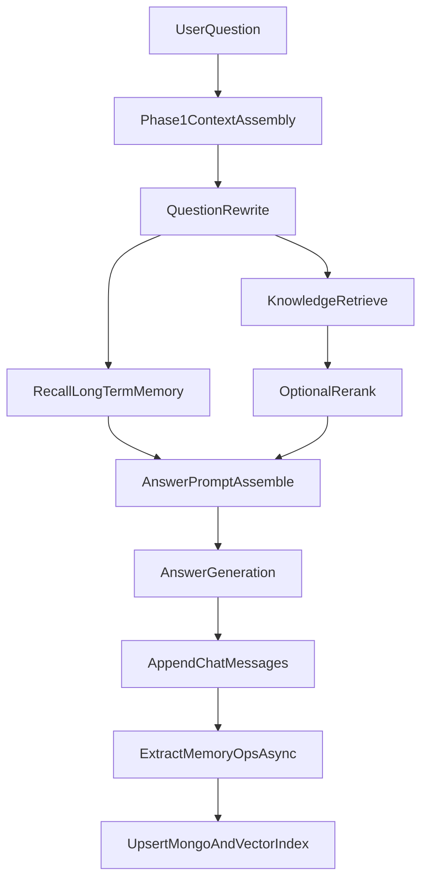

# 第二阶段实施方案：长期记忆抽取与语义召回（核心闭环）

本文档是 `Phase 2` 的详细落地方案，目标是在已完成 `Phase 1`（短期预算+画像记忆）的基础上，实现“长期记忆写入 + 语义召回入模”的最小可用闭环。

## 1. 阶段目标

- 把对话中的可复用信息沉淀为长期记忆（memory item）。
- 建立长期记忆向量索引，支持按语义召回高相关片段。
- 将召回的长期记忆注入 answer 阶段 prompt，提升跨轮一致性。
- 保持主链路稳定：任何 memory 子链路失败都可降级，不影响回答可用性。

## 2. 阶段边界

### 2.1 本阶段包含

- memory item 抽取（先覆盖 `preference` / `constraint`，再扩展 `fact` / `decision`）。
- Mongo 主存储（`chat_memories`）+ Weaviate 记忆索引（`ConversationMemory`）。
- 读路径召回服务（过滤、打分、截断、注入 answer prompt）。
- 写路径异步触发（回答后抽取并 upsert）。
- 基础去重与冲突处理（MVP 级）。

### 2.2 本阶段不包含

- 复杂多用户跨会话知识蒸馏。
- 高级冲突图谱、长期自动清理策略（可留给 Phase 3）。
- rewrite 阶段强依赖长期记忆（Phase 2 先只注入 answer，降低风险）。

## 2.3 多用户隔离原则（必须）

- 长期记忆必须按用户隔离，禁止跨用户共享。
- 所有 memory 读写操作都必须携带并校验 `user_id`。
- 向量检索必须包含 `user_id` 过滤条件，不能仅靠相似度排序。
- 管理操作（update/delete）必须验证“操作者 `user_id` 与 memory 归属一致”。

建议作用域策略：

- `scope=user`：跨会话长期记忆（偏好、约束、稳定事实）。
- `scope=session`：当前会话记忆（临时决策、短期上下文）。

召回顺序建议：

1. 先召回 `scope=user` 且 `user_id=当前用户`；
2. 再召回 `scope=session` 且 `session_id=当前会话`；
3. 合并去重后统一排序注入。

## 3. 整体数据流



## 4. 数据模型设计

## 4.1 Mongo：`chat_memories`

建议字段：

- `memory_id: str`（UUID）
- `session_id: str`
- `user_id: str`（必填，长期记忆隔离主键）
- `scope: "session" | "user"`
- `type: "fact" | "preference" | "constraint" | "decision"`
- `content: str`
- `summary: str`
- `confidence: float`
- `salience: float`
- `is_active: bool`
- `source_message_ids: list[str]`
- `created_at: datetime`
- `updated_at: datetime`
- `last_accessed_at: datetime | null`
- `expires_at: datetime | null`

索引建议：

- `user_id + scope + is_active + updated_at`
- `user_id + session_id + is_active + updated_at`
- `expires_at`（用于后续 TTL 清理）

## 4.2 Weaviate：`ConversationMemory`

属性建议：

- `content`（TEXT）
- `memory_id`（TEXT）
- `session_id`（TEXT）
- `user_id`（TEXT，检索必须过滤）
- `scope`（TEXT）
- `type`（TEXT）
- `confidence`（NUMBER）
- `salience`（NUMBER）
- `is_active`（BOOL）
- `created_at`（TEXT）
- `expires_at`（TEXT）

向量来源：

- 使用现有 embedding 客户端（`OllamaEmbeddingsClient`）对 `content` 向量化。

检索约束：

- query 时必须附带 filter：`user_id == current_user_id`；
- 如召回 `scope=session`，再叠加 `session_id == current_session_id`；
- 任意缺失 `user_id` 的 memory 文档视为脏数据，不允许参与召回。

## 5. 配置项（建议新增）

在 `app/core/config.py` 增加：

- `memory_long_enable` (`MEMORY_LONG_ENABLE`, default `false`)
- `memory_write_async` (`MEMORY_WRITE_ASYNC`, default `true`)
- `memory_long_top_k` (`MEMORY_LONG_TOP_K`, default `6`)
- `memory_long_inject_top_n` (`MEMORY_LONG_INJECT_TOP_N`, default `3`)
- `memory_min_score` (`MEMORY_MIN_SCORE`, default `0.45`)
- `memory_collection` (`MONGODB_MEMORY_COLLECTION`, default `chat_memories`)
- `memory_weaviate_collection` (`WEAVIATE_MEMORY_COLLECTION`, default `ConversationMemory`)
- `memory_extract_turns` (`MEMORY_EXTRACT_TURNS`, default `2`)
- `memory_extract_types` (`MEMORY_EXTRACT_TYPES`, default `preference,constraint,fact,decision`)
- `memory_user_scope_enable` (`MEMORY_USER_SCOPE_ENABLE`, default `true`)
- `memory_require_user_id` (`MEMORY_REQUIRE_USER_ID`, default `true`)

## 6. 服务拆分与职责

新增目录文件建议（`app/services/rag/`）：

- `memory_models.py`
  - Pydantic 模型：`MemoryItem`, `MemoryOp`, `MemoryRecallItem`
- `memory_store.py`
  - Mongo 主存读写
  - Weaviate 索引 upsert / query
- `memory_extractor.py`
  - 调 LLM 进行结构化抽取（返回 `MemoryOp[]`）
- `memory_recall.py`
  - query embedding -> 向量检索 -> 过滤 -> 综合排序 -> 截断
- `memory_formatter.py`
  - 召回结果渲染为 prompt 文本，控制长度

## 7. 写路径详细设计（Extract + Upsert）

### 7.1 触发点

- `ChatRagService.chat()` 成功返回前，`append_messages` 之后触发。
- 默认异步执行（`memory_write_async=true`），失败不影响主流程。

### 7.2 抽取输入

- 当前轮 `question` + `answer`
- 最近 `memory_extract_turns` 轮短期消息
- 当前 session profile（可选，用于避免重复抽取）
- `user_id`（必需，用于归属与权限）

当 `memory_require_user_id=true` 时：

- 无 `user_id` 请求不执行 Phase 2 记忆写入；
- 仅保留 Phase 1 行为（短期预算+画像记忆）。

### 7.3 抽取输出约束

LLM 必须返回严格 JSON：

```json
{
  "ops": [
    {
      "op": "add",
      "type": "constraint",
      "scope": "session",
      "content": "回答必须使用中文简体",
      "summary": "语言约束",
      "confidence": 0.92,
      "salience": 0.88
    }
  ]
}
```

仅允许：

- `op in {add, update, delete, ignore}`
- `type in {fact, preference, constraint, decision}`

非法输出处理：

- JSON 解析失败、字段越界、空内容 => 全部丢弃并记录日志。

### 7.4 去重与冲突（MVP）

- 语义去重：
  - 对待写入 `content` 向量化，查询同 `user_id` + 同 type 的 topN；
  - 若相似度超过阈值（如 `0.90`），改为 `update`。
- 冲突处理：
  - 同 key 互斥项按 `recency * confidence * salience` 选主；
  - 旧项置 `is_active=false`（不物理删除）。

## 8. 读路径详细设计（Recall + Inject）

### 8.1 召回流程

1. 对 `rewritten_query`（优先）或原问题做 embedding。
2. 查询 Weaviate `ConversationMemory` topK（强制 `user_id` filter）。
3. 过滤：
   - `is_active=true`
   - 未过期
   - `score >= memory_min_score`
4. 作用域融合：
   - `scope=user` 结果 + `scope=session` 结果合并去重。
5. 排序打分：
   - `final_score = sim_score * type_weight * time_decay * confidence`
6. 截断：
   - `memory_long_inject_top_n` 条。

### 8.2 类型权重建议

- `constraint`: `1.30`
- `preference`: `1.15`
- `decision`: `1.05`
- `fact`: `1.00`

### 8.3 注入方式

Phase 2 先接入 answer prompt，不直接影响 rewrite：

- 在 `AnswerGenerationService.generate_answer(...)` 新增 `long_term_memory_context` 参数；
- 格式示例：
  - `- [constraint] 回答必须使用中文简体`
  - `- [preference] 回答风格简洁`

## 9. 代码改造清单（文件级）

## 9.1 扩展现有文件

- `app/schemas/chat.py`
  - 增加 `user_id` 字段（或由鉴权中间件注入）
- `app/core/config.py`
  - 新增 Phase 2 配置项
- `app/integrations/weaviate_client.py`
  - 增加 memory collection 的 ensure/upsert/search 能力
- `app/integrations/mongodb_chat_store.py`
  - 增加 `chat_memories` 集合读写接口
- `app/services/rag/pipeline.py`
  - 读路径：调用 `memory_recall` 并注入 answer
  - 写路径：`append_messages` 后触发 `memory_extractor + upsert`
- `app/services/rag/chains.py`
  - 增加 `long_term_memory_context` 注入段

## 9.2 新增文件

- `app/services/rag/memory_models.py`
- `app/services/rag/memory_store.py`
- `app/services/rag/memory_extractor.py`
- `app/services/rag/memory_recall.py`
- `app/services/rag/memory_formatter.py`

## 10. 任务拆分（建议按 PR）

- `P2-01 配置与模型骨架`
  - 配置项、Pydantic 模型、接口定义
- `P2-02 存储层实现`
  - Mongo memory 主存 + Weaviate memory 索引
- `P2-03 抽取器实现`
  - LLM JSON 抽取、校验、异常降级
- `P2-04 召回器实现`
  - 向量查询、过滤、打分、截断
- `P2-05 Pipeline 接入`
  - answer 注入 + write async
- `P2-06 测试与观测`
  - 单测、集成、日志指标

## 11. 测试计划

### 11.1 单测

- 抽取器：
  - 合法 JSON / 非法 JSON / 空输出
- 召回器：
  - 低分过滤、过期过滤、权重排序
- 去重逻辑：
  - 高相似命中 update，低相似新增 add

### 11.2 集成测试

- 连续 20+ 轮对话后可命中早期约束/偏好/事实；
- memory 子链路失败时，主链路仍返回答案；
- 关闭 `MEMORY_LONG_ENABLE` 时行为与 Phase 1 一致。
- 两个不同 `user_id` 的同类问题，召回结果完全隔离（无串数据）。
- 未携带 `user_id` 且 `memory_require_user_id=true` 时，不执行 Phase 2 写入/召回。

### 11.3 验收指标

- memory 抽取成功率（结构化通过率）
- memory 召回命中率
- 注入 memory 条目数（P50/P95）
- 回答一致性提升（约束遵从率）
- 请求耗时增加可控（建议 P95 增量 < 20%）

## 12. 风险与回退

- 风险：抽取噪声导致误记忆
  - 方案：高置信阈值 + 先只注入 topN + 人工抽样审查日志
- 风险：召回错误导致回答偏移
  - 方案：最小分数阈值 + 类型权重 + 低优先级注入
- 风险：额外耗时
  - 方案：写路径异步、读路径限 topK、必要时缓存
- 风险：跨用户记忆泄漏
  - 方案：全链路强制 `user_id` 过滤 + 回归测试 + 日志审计

回退策略：

- `MEMORY_LONG_ENABLE=false` 立即关闭 Phase 2，保留 Phase 1 能力不变。

## 13. 里程碑建议

- Day 1-2：配置、模型、存储层
- Day 3：抽取器（MVP：先 `preference/constraint`）
- Day 4：召回器 + answer 注入
- Day 5：回归测试 + 指标观察 + 阈值微调

---

建议上线顺序：

1. 灰度开启 `MEMORY_LONG_ENABLE`（仅内部会话）。
2. 观察 2~3 天日志（抽取质量、召回命中、时延）。
3. 扩大流量并逐步放开 `fact/decision` 类型。
