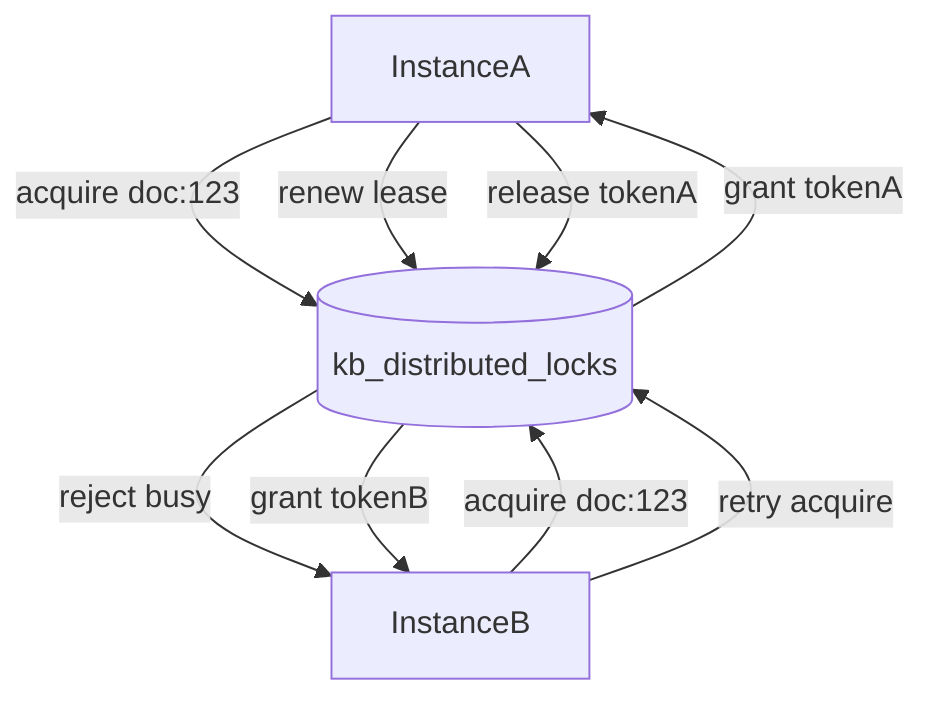

# MongoDB 分布式锁方案（知识库版本管理）

## 目标与边界

- 将当前进程内 `document_id` 互斥升级为跨实例互斥，避免多副本并发写同一文档。
- 覆盖关键写路径：`ingest_files(document_id 场景)`、`publish_document`、`delete_document`。
- 保持现有 API 不变，仅在服务层增加锁能力。

## 接入文件

- 核心接入点：`d:\Projects\rag_bot_demo\app\services\ingest\pipeline.py`
- Mongo 现有集成：`d:\Projects\rag_bot_demo\app\integrations\mongodb_chunk_store.py`
- 配置入口：`d:\Projects\rag_bot_demo\app\core\config.py`
- 配置示例：`d:\Projects\rag_bot_demo\.env.example`
- 文档说明：`d:\Projects\rag_bot_demo\docs\config_reference.md`

## 锁模型（Lease + TTL）

- 新增集合：`kb_distributed_locks`。
- 文档结构：
  - `_id`: `lock_key`（如 `doc:{document_id}`）
  - `owner_id`: 实例唯一标识（`hostname:pid:uuid`）
  - `token`: 本次锁令牌（随机 UUID，用于安全释放）
  - `acquired_at`: 获取时间（UTC）
  - `expires_at`: 过期时间（UTC，租约截止）
  - `updated_at`: 最近续租时间（UTC）
- 索引策略：
  - `_id` 唯一（天然）
  - `expires_at` TTL 索引（`expireAfterSeconds: 0`），用于清理过期锁文档

## 协议与语义

- `try_acquire(lock_key, owner_id, lease_seconds)`：
  - 使用 `findOneAndUpdate(..., upsert=True)` + 条件：`_id=lock_key` 且（不存在或 `expires_at <= now` 或 `owner_id==self`）。
  - 成功返回 `token`；失败返回 `None`。
- `acquire_with_retry(...)`：
  - 带超时重试（指数退避 + 抖动），超时抛 `LockAcquireTimeoutError`。
- `renew(lock_key, owner_id, token, lease_seconds)`：
  - 条件匹配 `_id + owner_id + token` 后更新 `expires_at`。
  - 失败表示锁已丢失，调用方应中止关键流程。
- `release(lock_key, owner_id, token)`：
  - 条件删除 `_id + owner_id + token`，防止误删他人新锁。

## 在业务中的使用方式

- 引入 `asynccontextmanager`：`distributed_lock(lock_key, timeout_seconds, lease_seconds)`。
- 写操作流程：
  1. 进入分布式锁上下文
  2. 启动续租后台任务（长事务每 `lease/3` 续租）
  3. 执行 ingest/publish/delete 关键逻辑
  4. 退出时停止续租并按 `token` 释放
- 与本地锁关系：
  - 可保留现有进程内锁作为本地降冲突优化（可选）
  - 以分布式锁作为最终一致并发保护

## 关键参数（新增配置）

- `MONGODB_LOCK_COLLECTION=kb_distributed_locks`
- `MONGODB_LOCK_LEASE_SECONDS=30`
- `MONGODB_LOCK_ACQUIRE_TIMEOUT_SECONDS=20`
- `MONGODB_LOCK_RETRY_INTERVAL_MS=200`
- `MONGODB_LOCK_ENABLE_RENEW=true`

## 异常与恢复策略

- 获取失败：返回可识别业务错误（文档正在被其他实例处理，请稍后重试）。
- 续租失败：立即中止流程并记录 `lock_lost` 日志，避免并发写污染。
- 进程崩溃：依赖租约超时自动回收。
- 时钟漂移：统一使用 `datetime.now(timezone.utc)`，并在 lease 上留安全余量。

## 可观测性

- 结构化日志字段：`lock_key`, `owner_id`, `token`, `phase(acquire|renew|release)`, `elapsed_ms`, `result`。
- 监控指标建议：
  - 锁获取成功率
  - 平均获取等待时长
  - 续租失败次数
  - 超时放弃次数

## 测试计划

- 单元测试：
  - 竞争获取锁，仅一个成功
  - 同 owner 可重入更新租约（若设计为可重入）
  - token 不匹配无法释放
  - 过期锁可被新 owner 抢占
- 服务级测试（mock Mongo）：
  - 同 `document_id` 跨“实例”并发 publish 串行化
  - 获取超时时返回明确错误
  - 长事务续租成功不中断

## 数据流示意

## 分阶段落地

1. 新增 `MongoDistributedLock` 组件与索引初始化。
2. 在 `IngestService` 写路径替换/叠加锁上下文。
3. 新增配置项与文档。
4. 补齐单元测试和服务级并发测试。
5. 预发压测并观察锁指标后再全量开启。
